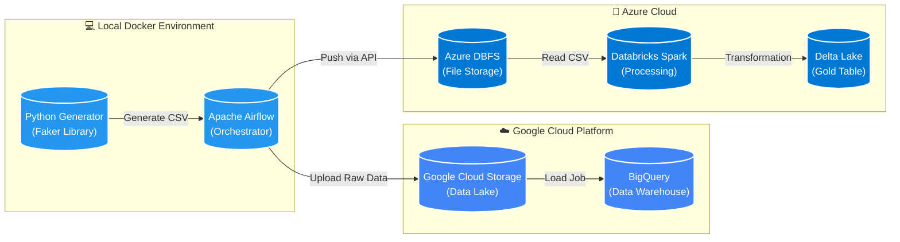
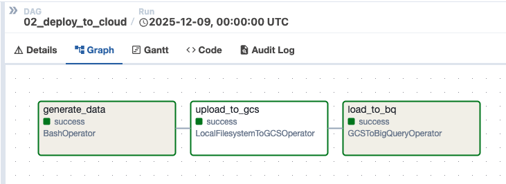
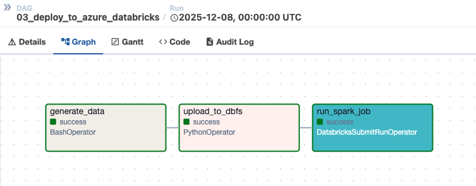
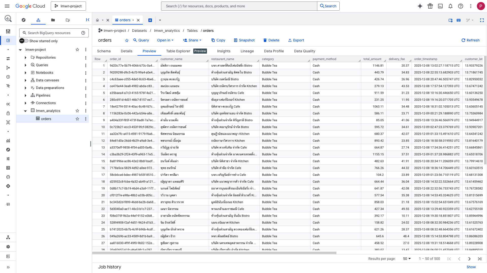
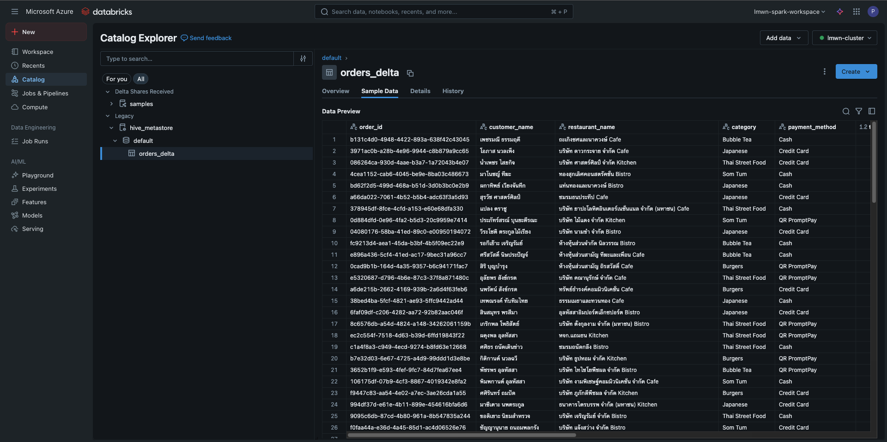

# 🛵 Bangkok Food Delivery Data Platform
### End-to-End Data Engineering Pipeline (Local → GCP → Databricks)


## 📋 Project Overview
This project simulates a **Food Delivery Data Platform** for the Bangkok metropolitan area. It generates realistic mock delivery orders (using Thai localization) and processes them through a modern hybrid-cloud data pipeline.

The goal was to build a robust ELT pipeline that mimics real-world scenarios demonstrating proficiency in **Data Lakehouse architecture**, **Cloud Engineering**, and **Distributed Processing**.

---

## 🏗️ Architecture

The pipeline consists of three main phases orchestrated by **Apache Airflow**:

1.  **Ingestion (Local):** Python script generates realistic transaction data (with simulated "dirty" data like negative values or nulls) and saves it locally.
2.  **Staging (Google Cloud):** Raw CSV files are uploaded to a **Google Cloud Storage (GCS)** Data Lake.
3.  **Warehousing & Processing (Hybrid):**
    * **Path A (Analytics):** Data is loaded into **Google BigQuery** for SQL-based analytics.
    * **Path B (Big Data):** Data is pushed to **Azure Databricks**, processed with **PySpark**, and stored as a **Delta Table**.

---

## 🛠️ Tech Stack
| Component | Technology | Description |
| :--- | :--- | :--- |
| **Orchestration** | **Apache Airflow 2.9** | Managing dependencies and scheduling DAGs daily. |
| **Containerization** | **Docker & Docker Compose** | Ensuring a reproducible local development environment. |
| **Language** | **Python 3.12** | Used for custom operators, data generation (`Faker`), and scripts. |
| **Cloud Storage** | **Google Cloud Storage (GCS)** | Data Lake for storing raw CSV logs. |
| **Data Warehouse** | **Google BigQuery** | Serverless warehouse for business analytics (SQL). |
| **Big Data Proc.** | **Azure Databricks (Spark)** | PySpark jobs for transforming raw data into Delta Tables. |

---

## 🚀 Key Features
* **🇹🇭 Thai Localization:** Uses `Faker('th_TH')` to generate realistic Thai names, addresses, and restaurants within specific Bangkok lat/long coordinates.
* **🌩️ Hybrid Cloud:** Demonstrates ability to work across clouds (connecting local Airflow to both **GCP** and **Azure**).
* **🛡️ Quality Checks:** Pipeline handles "dirty data" scenarios and ensures encoding (UTF-8) integrity for Thai characters.
* **Infrastructure as Code:** Entire Airflow setup is defined via `docker-compose` and Python DAGs.

---

## 📸 Pipeline Visuals

### 1. Airflow DAGs
*Automated pipeline running successfully.*



### 2. BigQuery Warehouse
*Data loaded successfully into Google Cloud for analysis.*


### 3. Databricks Delta Lake
*Spark processing verification.*


---

## 💻 How to Run

### Prerequisites
* Docker Desktop installed (and running).
* Google Cloud Service Account Key (`google_credentials.json`).
* Azure Databricks Workspace (or Community Edition).

### Steps
1.  **Clone the Repository**
    ```bash
    git clone [https://github.com/YOUR_USERNAME/bkk-food-data-platform.git](https://github.com/YOUR_USERNAME/bkk-food-data-platform.git)
    cd bkk-food-data-platform
    ```

2.  **Setup Credentials**
    * Place `google_credentials.json` inside the `dags/` folder.
    * Update `databricks_pipeline.py` with your Cluster ID.

3.  **Launch Airflow**
    ```bash
    docker-compose up --build
    ```

4.  **Access UI**
    * Go to `http://localhost:8080` (User/Pass: `admin`/`admin`).
    * Trigger the DAGs!

---

## 🧠 What I Learned
* **Cross-Cloud Networking:** Solving connectivity issues between local Docker containers, GCS, and Azure Databricks APIs.
* **Docker Optimization:** fixing build times on Apple Silicon by pinning specific Python constraints.
* **Data Quality:** The importance of enforcing `UTF-8` encoding when dealing with non-English languages (Thai) in data pipelines.
