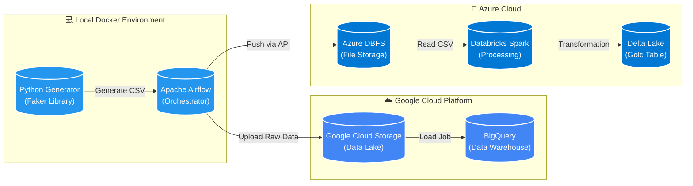
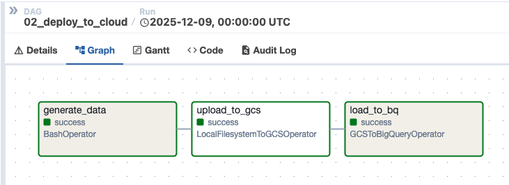
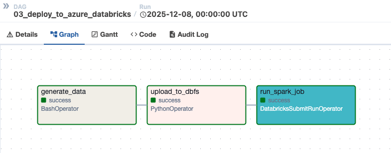
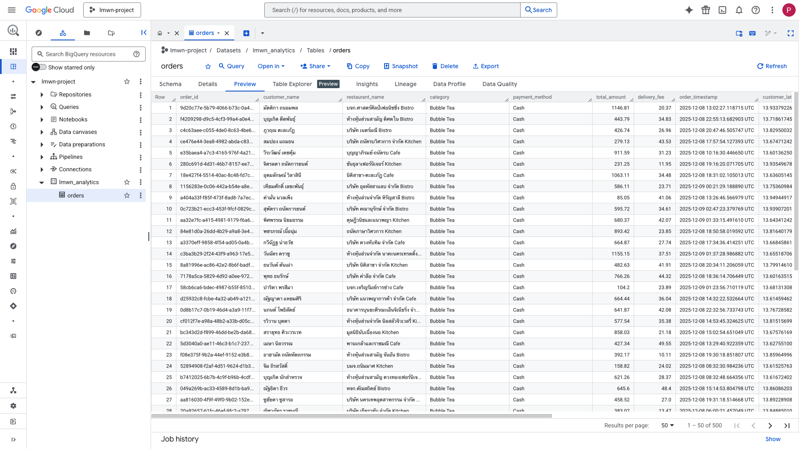
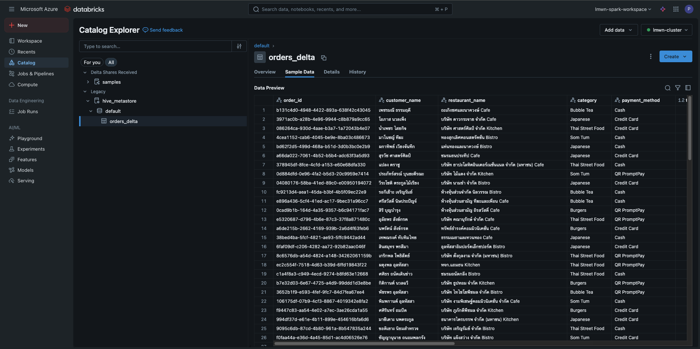

# 🛵 Bangkok Food Delivery Data Platform
### End-to-End Data Engineering Pipeline (Local → GCP → Databricks)


## 📋 Project Overview
This project simulates a **Food Delivery Data Platform** for the Bangkok metropolitan area. It generates realistic mock delivery orders (Thai-localized) and processes them through a modern hybrid-cloud ELT pipeline — landing raw data in a cloud data lake, then fanning out to both a **data-warehouse path** (BigQuery) and a **lakehouse path** (Databricks/Delta) from a single Airflow control plane.

The goal: a robust, replayable ELT pipeline that exercises real-world concerns — dirty-data handling, UTF-8 integrity for Thai text, and cross-cloud orchestration — rather than a clean toy dataset.

---

## 🏗️ Architecture

```mermaid
graph LR
    subgraph Local_Environment ["💻 Local Docker Environment"]
        Gen[("Python Generator<br/>(Faker Library)")]
        Airflow[("Apache Airflow<br/>(Orchestrator)")]
    end

    subgraph Google_Cloud ["☁️ Google Cloud Platform"]
        GCS[("Google Cloud Storage<br/>(Data Lake)")]
        BQ[("BigQuery<br/>(Data Warehouse)")]
    end

    subgraph Azure_Cloud ["🔷 Azure Cloud"]
        DBFS[("Azure DBFS<br/>(File Storage)")]
        Spark[("Databricks Spark<br/>(Processing)")]
        Delta[("Delta Lake<br/>(Gold Table)")]
    end

    %% Data Flow
    Gen -->|Generate CSV| Airflow
    
    %% Path 1: GCP
    Airflow -->|Upload Raw Data| GCS
    GCS -->|Load Job| BQ

    %% Path 2: Databricks
    Airflow -->|Push via API| DBFS
    DBFS -->|Read CSV| Spark
    Spark -->|Transformation| Delta

    %% Styling
    classDef docker fill:#2496ED,stroke:#fff,stroke-width:2px,color:#fff;
    classDef gcp fill:#4285F4,stroke:#fff,stroke-width:2px,color:#fff;
    classDef azure fill:#0078D4,stroke:#fff,stroke-width:2px,color:#fff;
    
    class Gen,Airflow docker;
    class GCS,BQ gcp;
    class DBFS,Spark,Delta azure;
```
The pipeline consists of three main phases orchestrated by **Apache Airflow**:

1.  **Ingestion (Local):** Python script generates realistic transaction data (with simulated "dirty" data like negative values or nulls) and saves it locally.
2.  **Staging (Google Cloud):** Raw CSV files are uploaded to a **Google Cloud Storage (GCS)** Data Lake.
3.  **Warehousing & Processing (Hybrid):**
    * **Path A (Analytics):** Data is loaded into **Google BigQuery** for SQL-based analytics.
    * **Path B (Big Data):** Data is pushed to **Azure Databricks**, processed with **PySpark**, and stored as a **Delta Table**.

---

## 🛠️ Tech Stack
| Component | Technology | Description |
| :--- | :--- | :--- |
| **Orchestration** | **Apache Airflow 2.9** | Managing dependencies and scheduling DAGs daily. |
| **Containerization** | **Docker & Docker Compose** | Ensuring a reproducible local development environment. |
| **Language** | **Python 3.12** | Used for custom operators, data generation (`Faker`), and scripts. |
| **Cloud Storage** | **Google Cloud Storage (GCS)** | Data Lake for storing raw CSV logs. |
| **Data Warehouse** | **Google BigQuery** | Serverless warehouse for business analytics (SQL). |
| **Big Data Proc.** | **Azure Databricks (Spark)** | PySpark jobs for transforming raw data into Delta Tables. |

---

## 🚀 Key Features
* **🇹🇭 Thai Localization:** Uses `Faker('th_TH')` to generate realistic Thai names, addresses, and restaurants within specific Bangkok lat/long coordinates.
* **🌩️ Hybrid Cloud:** Demonstrates ability to work across clouds (connecting local Airflow to both **GCP** and **Azure**).
* **🛡️ Quality Checks:** Pipeline handles "dirty data" scenarios and ensures encoding (UTF-8) integrity for Thai characters.
* **Infrastructure as Code:** Entire Airflow setup is defined via `docker-compose` and Python DAGs.

---

## 🧭 Design Decisions

* **Why both BigQuery *and* Databricks?** Deliberate — the two serve different consumers. **BigQuery** is the warehouse path: serverless, SQL-first, for fast ad-hoc business analytics. **Databricks + Delta** is the lakehouse path: PySpark transformation with schema-enforced, ML-ready Delta tables. The project intentionally demonstrates both the **data-warehouse** and **lakehouse** patterns rather than committing to one paradigm.
* **Airflow as a single cross-cloud control plane.** One DAG orchestrates local generation → GCS → BigQuery → Databricks, so cross-cloud complexity is centralized and observable instead of scattered across per-cloud schedulers.
* **GCS as a landing zone before load.** Decouples ingestion from consumption — raw CSVs are durably staged, so the BigQuery load and the Databricks read are independently replayable.
* **ELT, not ETL.** Land raw first, transform downstream (in-warehouse and in-Spark), keeping the raw layer immutable and reprocessable.
* **Dirty data injected on purpose.** Negative values and nulls are generated deliberately to exercise the cleansing and quality-check logic, mirroring real upstream messiness.

---

## 📸 Pipeline Visuals

### 1. Airflow DAGs
*Automated pipeline running successfully.*



### 2. BigQuery Warehouse
*Data loaded successfully into Google Cloud for analysis.*


### 3. Databricks Delta Lake
*Spark processing verification.*


---

## 💻 How to Run

### Prerequisites
* Docker Desktop installed (and running).
* Google Cloud Service Account Key (`google_credentials.json`).
* Azure Databricks Workspace (or Community Edition).

### Steps
1.  **Clone the Repository**
    ```bash
    git clone https://github.com/LMondd/bkk-food-data-platform.git
    cd bkk-food-data-platform
    ```

2.  **Setup Credentials**
    * Place `google_credentials.json` inside the `dags/` folder.
    * Update `databricks_pipeline.py` with your Cluster ID.

3.  **Launch Airflow**
    ```bash
    docker-compose up --build
    ```

4.  **Access UI**
    * Go to `http://localhost:8080` (User/Pass: `admin`/`admin` — local default).
    * Trigger the DAGs!

---

## 🧠 Engineering Challenges Solved
* **Cross-Cloud Networking:** Resolved connectivity between local Docker containers, GCS, and the Azure Databricks API — authentication, file push via DBFS, and cluster targeting.
* **Reproducible Builds:** Fixed Docker build times on Apple Silicon by pinning specific Python constraints.
* **Encoding Integrity:** Enforced `UTF-8` end-to-end so Thai-language fields survive generation → GCS → BigQuery/Delta without corruption.
